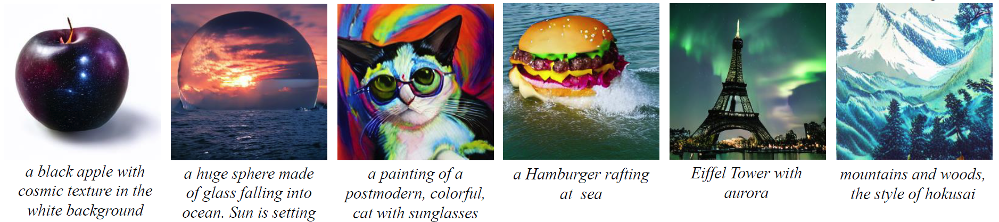

# Lformer
**Lformer: Text-to-Image Generation with L-shape Block Parallel Decoding**<br>
Jiacheng Li, Longhui Wei, ZongYuan Zhan, Xin He, Siliang Tang, Qi Tian, Yueting Zhuang



Lformer is semi-autoregressive text-to-image generation model. It is trained on 256×256 images from a subset of LAION 400M dataset. This model uses a frozen CLIP ViT-B/16 text encoder to condition the model on text prompts. 
The 1B model consists of a 63M text encoder, a 69M VQGAN, and a 918M generative transformer. It can generate 16 images in 9s with a V100 GPU.

## Requirements
Create and activate the enrionment:
```
conda env create -f environment.yaml
conda activate lformer
```

## Extract Features
Lformer adopts CVAE to introduce a latent variable w for global representation to the inconsistency of parallel generation.
This requires image features extracted by CLIP image encoder:
```
python scripts/extract_feature.py -b [config_path] -m [train/val]
```
The details of the config are setting in the config files configs/extract/extract_*.yaml

## Training
Lformer is implemented with pytorch-lightning, the training configs are handled by the [Trainer](https://pytorch-lightning.readthedocs.io/en/latest/api/pytorch_lightning.trainer.trainer.Trainer.html#pytorch_lightning.trainer.trainer.Trainer).<br>
The model configs are saved in the configs/[Dataset_Name]/[Model_Name].yaml<br>
To train a lformer:
```
python main.py -b [config_path] --gpus 0,1,2,3 --train_url [save_dir]
```
The default training strategy is pytorch DistributedDataParallel(DDP). 
To use Automatic Mixed Precision(AMP), specify with --precision=16. <br>
To use DeepSpeed, specify with --deepspeed=1 --precision=16 (DeepSpeed currently only works with fp16 precision)<br>
If the model trained with deepspeed, it needs to be converted with:
```
python scripts/zero_to_fp32.py [checkpoint_dir] [output_file]
```
The [checkpoint_dir] is the directory containing a link names 'latest' and a folder named 'checkpoint' containing .pt files.<br>
The [output_file] is the path of a ckpt file, e.g., /mydir/mymodel.pth

## Sampling
We support sampling with multi GPUs:
```
CUDA_VISIBLE_DEVICES=0,1,2,3 python scripts/sample.py -r [save_dir]
```
The configs of the sampling are setting in the function of 'get_parser' in the sample_utils.py and this sciprt samples with the validation set which is specified in the config file in the [save_dir]<br>
To sample with user input text, we also provide a demo built based on streamlit, to run the demo:
```
streamlit run scipts/stdemo.py -- -r [save_dir]
```
